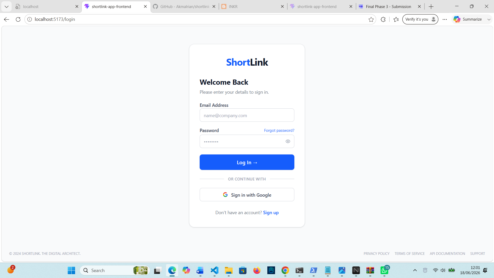
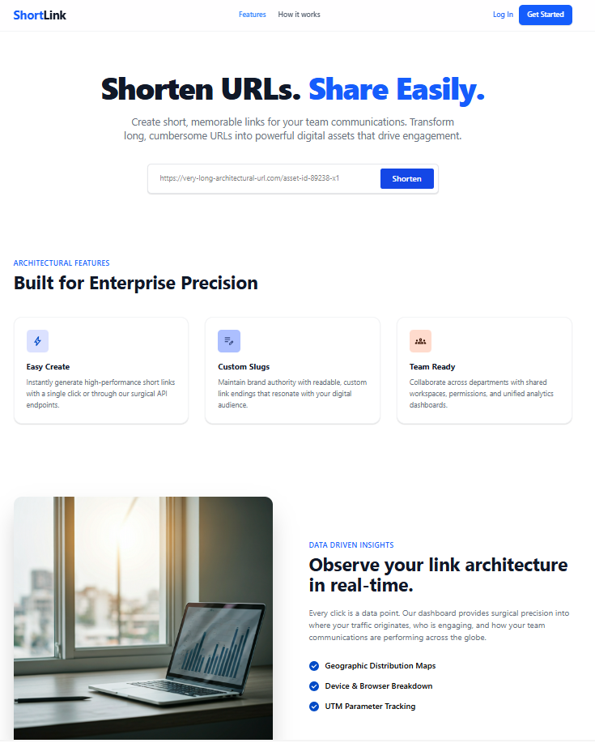
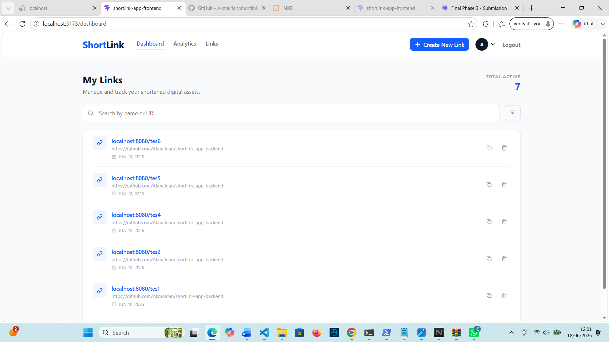
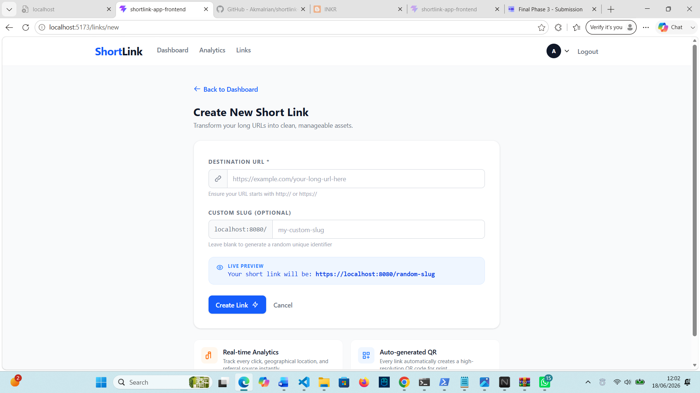
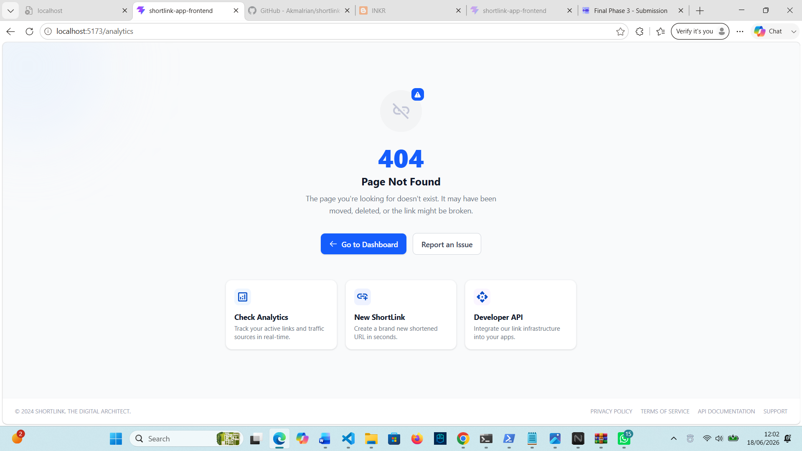

# ShortLink Frontend

Frontend application untuk layanan URL Shortener yang dibangun menggunakan React dan Vite.

Aplikasi ini menyediakan antarmuka pengguna untuk:

- Register akun
- Login pengguna
- Membuat Short URL
- Menggunakan Custom Slug
- Melihat daftar link yang dimiliki
- Mengelola link
- Melihat profil pengguna

Frontend terintegrasi dengan ShortLink Backend API menggunakan Axios dan JWT Authentication.

---

## 🛠 Tech Stack

### Frontend

- React.js
- Vite
- React Router
- Redux Toolkit
- Redux Persist
- Axios
- React Hot Toast

### Styling

- Tailwind CSS

---

## 📂 Project Structure

```text
shortlink-frontend/
│
├── public/
│
├── src/
│   ├── assets/
│   │
│   ├── components/
│   │   └── Reusable UI Components
│   │
│   ├── pages/
│   │   ├── LandingPage.jsx
│   │   ├── Login.jsx
│   │   ├── Register.jsx
│   │   ├── Dashboard.jsx
│   │   ├── CreateLink.jsx
│   │   ├── Profile.jsx
│   │   └── NotFound.jsx
│   │
│   ├── store/
│   │   └── Redux Store & Slices
│   │
│   ├── services/
│   │   └── API Services
│   │
│   ├── App.jsx
│   ├── main.jsx
│   └── index.css
│
├── .env.example
├── package.json
├── vite.config.js
└── README.md
```

---

## 🚀 Getting Started

### Prerequisites

Pastikan telah terinstall:

- Node.js 18+
- npm atau yarn
- Git

Cek versi:

```bash
node -v
npm -v
git --version
```

---

## 1. Clone Repository

```bash
git clone https://github.com/akmalrian/shortlink-app.git

cd shortlink-frontend
```

---

## 2. Install Dependencies

Menggunakan npm:

```bash
npm install
```

atau:

```bash
npm ci
```

---

## 3. Setup Environment Variables

Buat file `.env` dari template:

```bash
cp .env.example .env
```

Isi `.env`:

```env
VITE_API_URL=http://localhost:8080/api
```

Pastikan backend sudah berjalan pada URL tersebut.

---

## 4. Run Development Server

```bash
npm run dev
```

Aplikasi akan berjalan di:

```text
http://localhost:5173
```

---

## 5. Build Production

```bash
npm run build
```

Hasil build akan tersedia pada folder:

```text
dist/
```

Preview hasil build:

```bash
npm run preview
```

---

## Application Routes

### Public Routes

| Route | Description |
|---------|------------|
| `/` | Landing Page |
| `/auth/login` | Login Page |
| `/auth/register` | Register Page |

### Protected Routes

Memerlukan login terlebih dahulu.

| Route | Description |
|---------|------------|
| `/dashboard` | User Dashboard |
| `/dashboard/create-link` | Create Short Link |
| `/profile` | User Profile |

### Error Route

| Route | Description |
|---------|------------|
| `*` | Not Found Page |

---

## Backend Integration

Frontend berkomunikasi dengan backend melalui:

```env
VITE_API_URL=http://localhost:8080/api
```

Contoh endpoint yang digunakan:

```text
POST /auth/register
POST /auth/login
DELETE /auth/logout

POST /links
GET /links
DELETE /links/:id
```

---

## Design Decisions

### Component-Based Architecture

UI dibangun menggunakan reusable components agar lebih mudah dikembangkan dan dipelihara.

### Protected Routes

Halaman tertentu hanya dapat diakses oleh pengguna yang telah login menggunakan komponen:

```text
ProtectedRoute
```

### Tampilan Frontend






### Global State Management

Redux Toolkit digunakan untuk mengelola state aplikasi seperti:

- Authentication
- User Session
- Link Data

### Session Persistence

Redux Persist digunakan untuk mempertahankan sesi login ketika halaman direfresh.

### API Layer Separation

Semua komunikasi API ditempatkan pada folder:

```text
src/services/
```

agar pemanggilan API terpusat dan mudah dikelola.

---

## Available Scripts

Menjalankan development server:

```bash
npm run dev
```

Build production:

```bash
npm run build
```

Preview build:

```bash
npm run preview
```

Lint project:

```bash
npm run lint
```

---

## Author

**Akmal Oktarian**

GitHub: https://github.com/akmalrian

---

## 📄 License

This project is intended for educational and portfolio purposes.